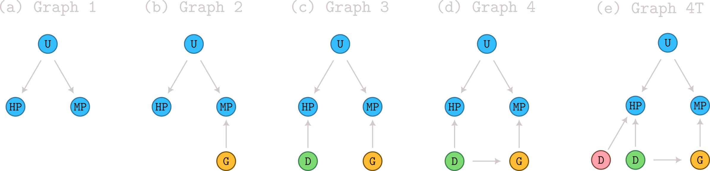

# INDIGENA: 



# Dependencies

## Groovy Baselines
- Groovy 4.0.26
- Java 8+

## Python KGE Methods
- Python 3.10
- mowl
- pykeen
- torch
- wandb
- pandas
- tqdm
- click


# Installation
```
git clone https://github.com/bio-ontology-research-group/indigena.git
cd indigena/
conda env create -f environment.yml
```

# Usage

## 1. Extract Data

First, extract the data archive:

```bash
tar -xzf data.tar.gz
```

## 2. Semantic Similarity Baselines (Groovy)

These baseline methods compute ontology-based semantic similarity between genes and diseases using the SLIB library.

### Run with default parameters:
```bash
groovy semantic_similarity.groovy -r data -fold 0
```

### Run with custom parameters:
```bash
groovy semantic_similarity.groovy -r data -ic resnik -pw resnik -gw bma -fold 0
```

### Run SimGIC variant:
```bash
groovy semantic_similarity_simgic.groovy -r data -ic resnik -fold 0
```

### Parameters:
- `-r, --root_dir`: Data directory (default: `data`)
- `-ic, --ic_measure`: Information content measure (`resnik`, `sanchez`)
- `-pw, --pairwise_measure`: Pairwise measure (`resnik`, `lin`)
- `-gw, --groupwise_measure`: Groupwise measure (`bma`, `bmm`)
- `-fold`: Cross-validation fold number (default: 0)

**Output:** Results saved to `data/baseline_results/`

### Evaluate results:
```bash
python evaluate_sem_sim.py data/baseline_results/<results_file>
```

## 3. Knowledge Graph Embeddings (Python)

This approach uses mOWL and PyKEEN to project the ontology to triples, train KGE models, and evaluate gene-disease associations by comparing phenotype embeddings.

### Run basic KGE model:
```bash
python kge.py --fold 0 --model_name transd --mode inductive --graph2 --no_sweep
```

### Run with hyperparameters:
```bash
python kge.py --fold 0 --model_name transd --mode inductive \
  --embedding_dim 100 --batch_size 128 --learning_rate 0.001 \
  --num_epochs 100 --graph2 
```

### Parameters:
- `--fold`: Cross-validation fold number
- `--model_name`: KGE model (`transe`, `transd`, `distmult`, `paire`)
- `--mode`: Evaluation mode (`inductive`, `transductive`)
- `--graph2`: Add gene-phenotype edges
- `--graph3`: Add disease-phenotype edges
- `--graph4`: Add gene-disease training edges
- `--embedding_dim`: Embedding dimensions
- `--batch_size`: Training batch size
- `--learning_rate`: Learning rate
- `--num_epochs`: Training epochs
- `--only_test`: Only test existing model (skip training)
- `--description`: Weights & Biases run description
- `--no_sweep`: Disable W&B sweep mode


